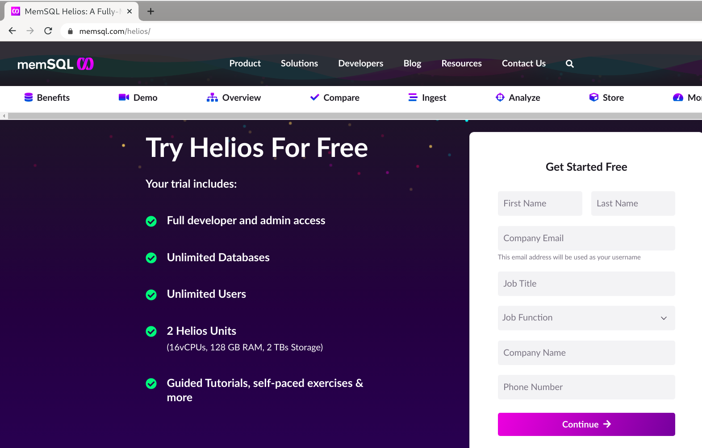
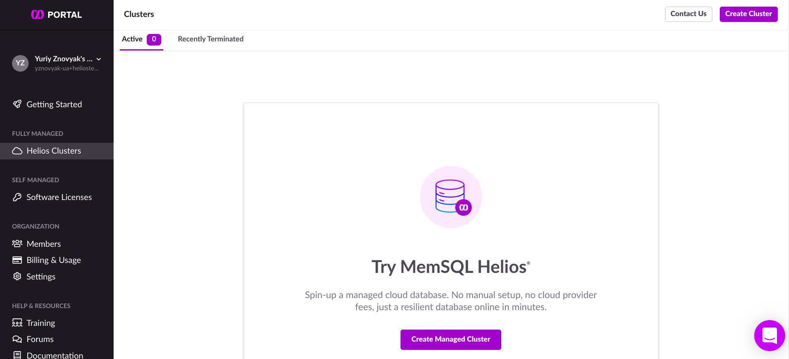
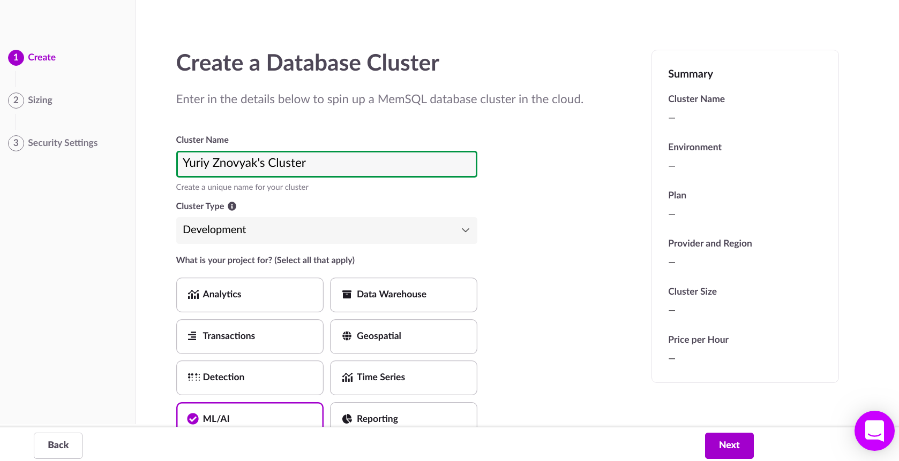
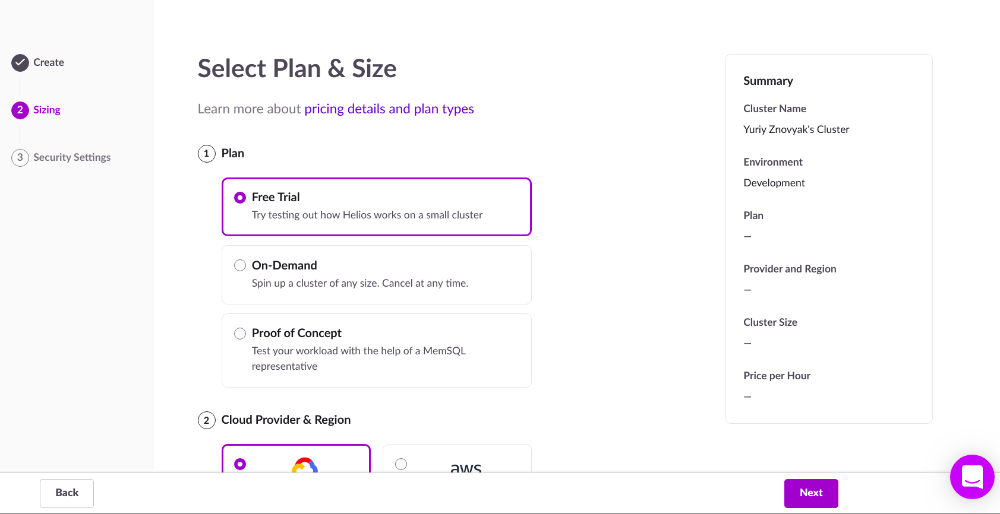
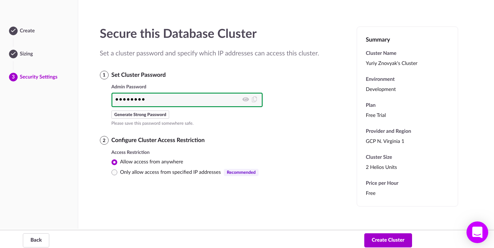
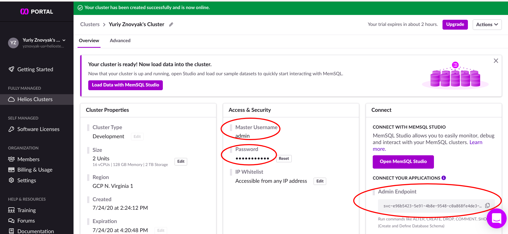

# Machine Learning via MemSQL

This repository contains examples of how machine learning models can be evaluated in a MemSQL database. Examples are contained in the [examples](examples) folder in the form of Jupyter notebooks.

## Contents

1. [[link]](examples/1.%20Training%20and%20deploying%20an%20xgboost%20model%20to%20MemSQL.ipynb) Training an XGBoost model on a local host, deploying and evaluating it on a MemSQL instance.
2. [[link]](examples/2.%20Training%20xgboost%20model%20on%20AWS%20sagemaker%20and%20deploy%20to%20memsql.ipynb) Training an XGBoost model using an [AWS Sagemaker](https://aws.amazon.com/sagemaker/), deploying and evaluating it on a MemSQL instance.
3. [[link]](examples/3.%20Ingesting%20data%20from%20Kafka%20and%20running%20classifier%20on%20it.ipynb) Evaluating an XGBoost model in a MemSQL instance with data that is streamed from Kafka.
4. [[link]](examples/4.%20Big%20data%20example.ipynb) Evaluating an XGBoost model in a MemSQL instance on a TPC-H 50GB dataset.

## Setup

Install the dependencies (Ubuntu/Debian). These steps are similar on non-dpkg-based systems.

```
apt install python3-pip python3-dev libmariadbclient-dev
```

Create and activate a virtual environment

```
pip3 install --upgrade pip && pip3 install virtualenv
virtualenv -p $(which python3) venv
source venv/bin/activate
```

Install all Python requirements

```
pip3 install -r requirements.txt
```

Enter the examples directory and run Jupyter

```
cd examples
jupyter notebook
```

This will launch a new browser window (or a new tab), but if it doesn't just open the displayed link in your browser (by default, http://localhost:8888).  Pick an example and play with it.  Do not stop Jupyter or close the terminal window until you're done.

## Obtain a MemSQL instance

If you don't yet have a MemSQL instance, you can try one for free at [memsql.com/helios](https://bit.ly/3jAKBUK):
1. Sign up, verify your email, and log in
   
2. Click "Create Managed Cluster"
   
3. Give your cluster a name and select AI/ML
   
4. Select free trial
   
5. Provide an admin password, select "Allow access from anywhere" (to simplify testing), and click "Create Cluster"
   
6. Wait for the cluster to be created and then use the admin endpoint to connect to it
   
